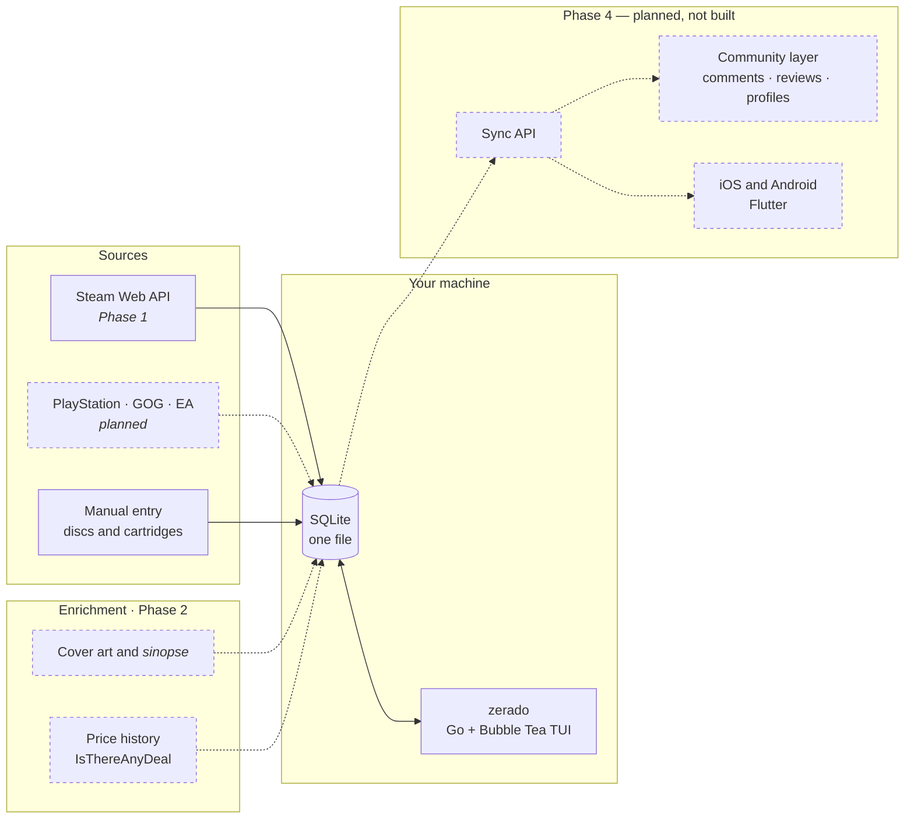

<div align="center">

<picture>
  <source media="(prefers-color-scheme: dark)" srcset="docs/brand/logo-mono-white.svg">
  <source media="(prefers-color-scheme: light)" srcset="docs/brand/logo-mono-black.svg">
  
</picture>

### Zerado — terminal game library

[](LICENSE)
[](../../actions/workflows/site.yml)
[%20%C2%B7%20Astro%20(site)-00ADD8?style=flat-square)](#tech-stack--and-why)
[](#status)

**[zerado.app](https://zerado.app) · [Join the waitlist](mailto:alex@flowforgesoft.com?subject=Zerado-WaitList)**

</div>

---

## What it is

You own 400 games. You've finished six. Most nights you scroll for twenty minutes
and start something you've already seen.

Zerado is a terminal program that reads your entire library — Steam first, then
PlayStation, GOG, EA, and the cartridges still on your shelf — and answers the
only question that actually matters at 11pm: **what do I play?**

It sorts by **mood**, not genre. Genre tells you what a game *is*; mood tells you
what tonight is *for* — mindless grind, story-rich and kind of sad, a quick
fifteen minutes, tactical and full focus. Pick a mood, get a game, play it
tonight.

It runs in your terminal, works with the network off, and everything it knows
lives in one file on your machine.

## The word

***Zerado*** is Brazilian Portuguese. Applied to a game it means **beaten** —
cleared, finished, 100%'d. The origin is the part worth keeping: it comes from
arcade cabinets, where a score counter that ran past its last digit rolled back
to zero. You had beaten the machine so thoroughly that its own display gave up.

Pronounced **zeh-RAH-doo**.

The word does double duty. It is the product, and it is a status inside the
product: marking a game *zerado*, in Zerado, is the whole point of it.

> **Casing, because there are three different objects here.** The product is
> `Zerado`. The command, the binary and the domain are lowercase `zerado`. The
> status in prose is lowercase *zerado*; in the interface it is the `ZERADO`
> chip. See [`docs/brand/naming.md`](docs/brand/naming.md).

## Status

**Pre-alpha. Nothing is runnable yet.** There is no binary to download, no
`go install` line that works, and no Go code in this repository.

What exists today is **Phase 0 — Foundation**: the landing page at
[zerado.app](https://zerado.app), the brand system, the ratified copy, the design
blueprint, and this repository. That is the public face, not the product.

**Phase 1 is in progress as of 2026-08-25** — the spine, design system and screen
specs ([#2](../../issues/2)). In progress means exactly that: work has started and
nothing is finished. No Go code has landed, and **no phase is complete.**

We would rather say that plainly than mark a phase done and be wrong about it.

## Roadmap

Four phases, in order. Phase 1 is under way — nothing here is marked done,
because that would be the one dishonest line in this file. No dates: dated
roadmaps convert better and age badly.

| | Phase | | Status |
|---|---|---|---|
| **1** | CLI/TUI MVP | Your library, your statuses, stored locally. | ◐ **In progress** |
| **2** | Enrichment | Covers, synopsis, prices, moods. | ○ Planned |
| **3** | Recommendations & Budget | What to buy, and whether to wait. | ○ Planned |
| **4** | Social & Mobile | Sync, community, the phone apps. | ○ Planned |

Every status co-renders as **colour + glyph + label**, here and on the site, so it
survives a monochrome screenshot and a colour-blind reader — the same rule the
four game states follow.

**After Phase 4 — ideas, not promises:** more storefronts beyond the four above,
deeper backlog analytics, and mood tagging that improves the more you use it.
Nothing there has a date and nothing there is a promise.

## Screenshots

**There are none, because there is nothing to photograph yet.**

Every terminal view on [zerado.app](https://zerado.app) is a **CSS mockup of the
planned interface**, and each one carries a visible caption on the page saying
exactly that. They are design intent, not captures of a running program. When
`zerado` runs, they will be replaced with real captures and this section will
carry them.

The four library states the mockups render are settled, and they are what the
program will show:

| Glyph | Chip | Meaning |
|---|---|---|
| `○` | `NOT STARTED` | In the library. Untouched. |
| `◐` | `IN PROGRESS` | Currently being played. |
| `◉` | `ZERADO` | Finished. |
| `⊘` | `ABANDONED` | Started, set down, not coming back to it. |

Every state is co-rendered as **colour + glyph + label**, never colour alone —
the palette has to survive a monochrome terminal, `NO_COLOR`, and colour-vision
deficiency. See [`docs/brand/brand-manual.md`](docs/brand/brand-manual.md).

## How it will work

Zerado is **local-first**. Your library is read from the sources you connect,
enriched, and written to **one SQLite file on your own machine**. The TUI reads
that file. There is no Zerado server in the loop, no account, and no sign-up —
and once the library is synced, the whole thing answers "what do I play" with
the network off.

The only thing that will ever run centrally is the **Phase 4 community layer**,
because sharing a comment with another person requires a server somewhere. It is
drawn below as planned, and it is not built.



Solid edges are Phase 1 — **in progress, not built.** Dashed edges and dashed
nodes are **planned and not started** — Phase 2 enrichment, and the Phase 4 sync
API, community layer and Flutter apps. Nothing in this diagram runs today.

## Install, build, run

### The program

**Not installable yet.** There is no release, no binary, no package. When Phase 1
lands, the install line goes here.

Once Go code exists, building from source will be the ordinary Go build — and
until then there is nothing in this repository to build:

```bash
git clone https://github.com/JustCode-CruzAlex/Zerado.git
cd Zerado
# go build ./cmd/zerado    ← Phase 1, does not exist yet
```

### The landing page

The site *is* buildable today, from a clean checkout, with no network access to
anything but the npm registry:

```bash
cd site
npm ci          # or: npm install
npm run build   # static output → site/dist/
npm run preview # http://localhost:4321/
```

> ⚠️ **Do not open `site/dist/index.html` by double-clicking it.** Astro emits
> root-absolute asset paths, so over `file://` the CSS never loads and the fonts
> are CORS-blocked — the page looks broken when it is not. Use `npm run preview`.

Requires Node.js **22.12.0+** and npm 10+ (Astro 7's floor). Full site notes:
[`site/README.md`](site/README.md).

## Configuration

**Nothing to configure yet** — there is no program to configure. What follows is
what Phase 1 will need, recorded now because it affects whether Zerado can see
your library at all.

**A free Steam Web API key.** It takes about a minute to generate at
[steamcommunity.com/dev/apikey](https://steamcommunity.com/dev/apikey).

**Your Steam profile — specifically your game details — must be public**, *or*
the key must belong to that same account. Steam simply does not return a library
for a private profile. That is a Steam setting, not something Zerado can work
around; you change it under **Steam → Profile → Edit Profile → Privacy
Settings → Game details → Public**.

The key is yours and stays on your machine. The intended shape — settled in code
by the Phase 1 blueprint ([#2](../../issues/2)), **not yet implemented** — is a
config file under `${XDG_CONFIG_HOME:-~/.config}/zerado/`, with an environment
variable as the override for people who keep secrets outside their dotfiles.
Zerado will never ask you to paste a key into a website.

## Data and privacy

- **Your library lives in one SQLite file on your machine.** You can back it up,
  move it, inspect it with any SQLite tool, or delete it. Nobody else holds a
  copy.
- **There is no Zerado server.** Not for your library, not for your statuses, not
  for your keys. There is nothing to breach because there is nothing there.
- **No account to use it.** Nothing to sign up for, nothing to log into, before
  it works.
- **The only network traffic is to the services you connect, with your own
  keys** — Steam, price data. Nothing about your library is sent to a
  Zerado-operated endpoint, because none exists.
- **No telemetry.** No analytics, no crash pings, no usage counters. The landing
  page carries none either: zero client-side JavaScript and zero external
  requests, verified in [`docs/qa/qa-report.md`](docs/qa/qa-report.md).
- **Phase 4 is the one exception, and it is opt-in by construction.** Comments,
  reviews and public profiles need a server. Nothing you have not explicitly
  shared will leave your machine.

## Tech stack — and why

| Layer | Choice |
|---|---|
| Language | **Go** |
| TUI | **[Bubble Tea](https://github.com/charmbracelet/bubbletea)** and the [Charm](https://charm.sh) ecosystem — lipgloss, bubbles, glamour, huh |
| Storage | **SQLite** — one local file, no daemon |
| Phone apps (Phase 4) | **Flutter** |
| Landing page | **[Astro](https://astro.build)** — static, zero client JS |

**Why Go and Charm, and not Rust and ratatui** — which is the reasonable
question, since ratatui is excellent. Zerado is the second product from
FlowForgeSoft, after [FlowForge](https://www.flowforgesoft.com). FlowForge is
already a large Go codebase with its own Bubble Tea component library, its own
spacing canon, and its own terminal design system, all of it tested and in daily
use. Building Zerado on that stack means the components, the layout discipline
and the accessibility rules come across for free instead of being rebuilt in a
second language. Choosing Rust here would mean starting the terminal layer from
nothing to gain performance a library browser does not need.

SQLite is the same argument in miniature: a library of a few thousand rows does
not need a server, and a single file is something a user can actually own.

## Contributing

Contributions are welcome, with one caveat worth setting straight up front: the
product is pre-alpha and the Phase 1 spine is still being specified, so the most
useful contributions right now are to the **site, the docs and the design
system** rather than to a program that does not exist yet.

Read **[CONTRIBUTING.md](CONTRIBUTING.md)** first — it covers branch naming,
commit messages, how to run the site, and the review bar a pull request has to
clear.

**Picking up a good first issue:** browse
[`good first issue`](../../issues?q=is%3Aissue+is%3Aopen+label%3A%22good+first+issue%22),
comment on the one you want so nobody doubles up, and open a draft pull request
early. If nothing is labelled yet, open a
[question issue](../../issues/new/choose) and ask — that is a perfectly good
first contribution.

Everyone taking part is expected to follow the
[Code of Conduct](CODE_OF_CONDUCT.md). Security issues do **not** go in the
issue tracker — see [SECURITY.md](SECURITY.md).

## The money, disclosed

Zerado itself is free, and this section exists so that nothing about how it is
paid for is a surprise later.

- **Affiliate commission.** When a price link in Zerado leads to a purchase,
  Zerado earns a commission. It costs you nothing extra, and it does not change
  which prices you are shown.
- **The Phase 4 community layer will need a premium account or a donation.**
  Comments, reviews and public profiles run on servers, and servers cost money.
  Nothing is decided about price, tiers, or a date.

**There is no donate button, no sponsor button and no funding call to action** —
not in this README, not in the repository, and not on the landing page. This is
disclosure, not an ask; nothing is buyable, so nothing is being sold. That is a
[ratified decision](docs/design/blueprint.md), and it holds until it is
explicitly re-ratified.

## Licence

Zerado's code and documentation are released under the **[MIT Licence](LICENSE)**
— chosen because Zerado is a client-side tool people run on their own machines,
and MIT puts the fewest obstacles between a user and running, forking or
packaging it.

Two things the MIT licence does **not** cover:

- **The bundled typefaces** — Orbitron, Space Grotesk and JetBrains Mono — are
  each under the SIL Open Font License 1.1. See
  [`site/public/fonts/LICENSE-FONTS.md`](site/public/fonts/LICENSE-FONTS.md).
- **The Zerado name, logotype and mark** are FlowForgeSoft's. The MIT grant
  covers the software, not the brand; forks are free to exist and should not
  ship under the Zerado identity.

**A [FlowForgeSoft](https://www.flowforgesoft.com) product.** Zerado is the
second product from FlowForgeSoft, the company behind FlowForge. Built with
FlowForge.

## Acknowledgements

- **[Steam Web API](https://steamcommunity.com/dev)** — the library, playtime
  and status data that Phase 1 reads, with your own key.
- **[IsThereAnyDeal](https://isthereanydeal.com)** — price history and all-time
  lows, from Phase 2 onward.
- **[Charm](https://charm.sh)** — Bubble Tea, lipgloss, bubbles, glamour and huh,
  which are why a terminal program can look like this at all.
- **[Astro](https://astro.build)** — the landing page's static build.
- **[SQLite](https://sqlite.org)** — the one file your library lives in.
- **Orbitron, Space Grotesk and JetBrains Mono** — the three typefaces, all
  OFL-1.1, named with their copyright holders in
  [`site/public/fonts/LICENSE-FONTS.md`](site/public/fonts/LICENSE-FONTS.md).

Two sources are deliberately **not** named, because naming them would not yet be
true: the provider for cover art and *sinopse* (Portuguese for synopsis, a short
plot summary) is not finalised, and the community top-lists planned for Phase 3
have no confirmed source. Both get named here the day they are real, and not a
day before.

---

<div align="center">

**[zerado.app](https://zerado.app)** · **[Join the waitlist](mailto:alex@flowforgesoft.com?subject=Zerado-WaitList)** · alex@flowforgesoft.com

*A FlowForgeSoft product.*

</div>
