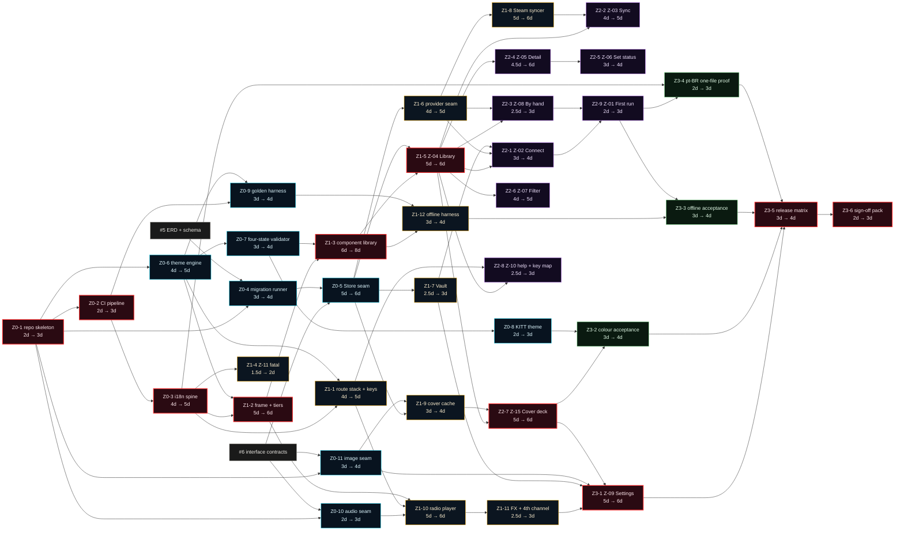
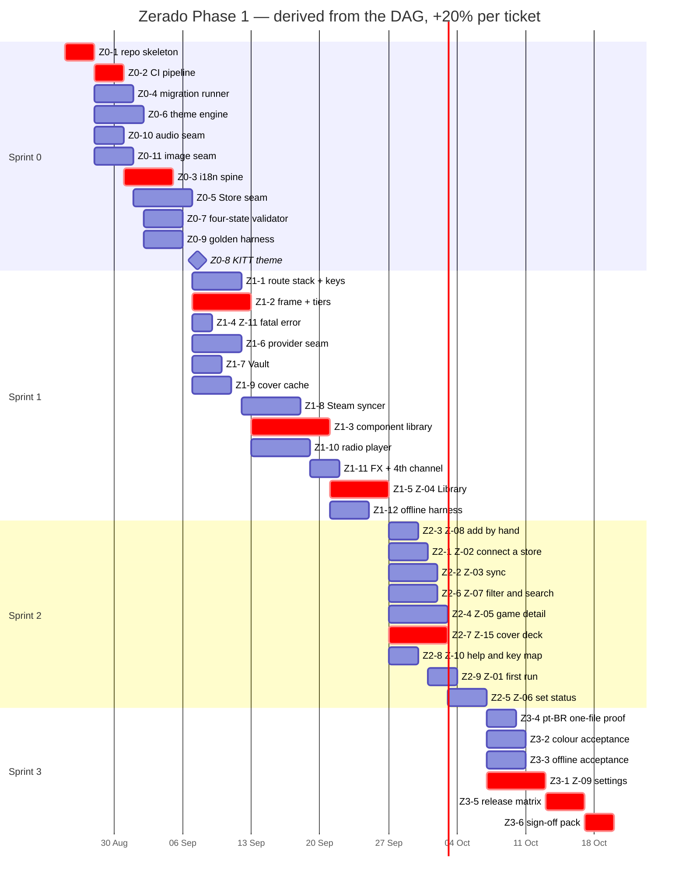

# The Phase 1 delivery DAG

**Thirty-eight work units, four sprints, 2026-08-25 → 2026-10-19.**

Every unit carries its **own** duration, stated before any date existed. Every date below is
**derived** — start is when that unit's dependencies finish, end is start plus the padded
duration. Nothing here was typed onto a ticket, and the founder was asked exactly one scheduling
question, which he had already answered: **Sprint 0 starts 2026-08-25.**

---

## 0 · What this was built from

| Input | State | What it contributed |
|---|---|---|
| [`../adr/ADR-0001`](../adr/ADR-0001-zerado-foundational-architecture.md) | **RATIFIED 2026-08-25**, with one amendment | The nine decisions that make a seam a seam. D1–D9 are the reason the units are cut where they are |
| [`../blueprint/`](../blueprint/00-index.md) — 17 documents | ratified | The spine: which screens exist, what each owes the player, where the seams are |
| [`../design/`](../design/00-design-brief.md) — 19 documents | ratified | The design system, the theme contract, the spacing canon |
| [`../design/screens/`](../design/screens/) — 12 specs, 11 572 lines | **11 of 12 ratified**; `Z-10` superseded (§9.2) | The buildable units. Each carries a state table and a key map, which is what makes a screen sizable at all |
| Ticket **#5** — ERD and schema | **in flight, parallel** | Node `#5`. Every unit that touches a table sits behind it |
| Ticket **#6** — interface contracts | **in flight, parallel** | Node `#6`. Every unit that touches a signature sits behind it |
| Ticket **#8** — key-map component visual spec | **CLOSED 2026-08-25** | Withdrawn by the founder mid-plan. `Z2-8` no longer depends on it (§9.2) |

`#5` and `#6` are running **right now**, in parallel with this plan. They are the first two nodes
of the graph and nothing waited on them: they were sequenced, not awaited.

---

## 1 · The rule this plan is built on

1. **Duration first, dates never.** Each unit states how long *that* piece of work takes, in days
   or weeks. **Hours are refused by name** — converting an hour to a calendar span needs a
   working-day length nobody has agreed, and a bar wrong by a factor of three is worse than a
   refusal.
2. **+20% breathing room per ticket, never pooled.** `3d` becomes a **4-day bar**; padding rounds
   **up**. Slack pooled on a sprint total does not live where the risk is.
3. **Dates derive from the DAG.** Two units with no edge between them **overlap**, and that
   overlap is the entire reason the chart is worth opening.
4. **A batch that has an order carries it as `Depends-on:` trailers.** Ordering that lives only in
   prose is invisible to the board: waves collapse to one, the dependency column renders blank,
   and nothing warns you.

The formula, so every number below is checkable by hand:

```
padded = ceil(stated × 1.2)
start  = 1 + max(end of every dependency)          # or the sprint's begin, whichever is later
end    = start + padded − 1                        # inclusive calendar days
```

---

## 2 · The work units

`M` = model · `E` = effort · `D` = that unit's **own** stated duration · `→` = padded bar.

### Sprint 0 — Scaffolding and the seams · 11 units

The sprint most likely to finish **early**. It carries no screen, no sync and no ambition: the
repo, the pipeline, the persistence floor, the theme system, the harnesses, and the two seams
whose default implementations are *null* by design.

| # | Ticket | Title | Kind | M | E | D | → | Depends on |
|---|---|---|---|---|---|---|---|---|
| **Z0-1** | **#10** | `[INFRA][GO]` Repo skeleton, module layout, Makefile, lint and the cross-compile matrix | chore | sonnet | medium | **2d** | 3d | — |
| **Z0-2** | **#11** | `[INFRA][CI]` The pipeline — test, lint, build matrix, coverage floor | chore | sonnet | medium | **2d** | 3d | `Z0-1` |
| **Z0-3** | **#17** | `[I18N]` The catalogue, `x/text`, width-aware measurement, and the no-literals lint that fails the build | feature | opus | high | **4d** | 5d | `Z0-2` |
| **Z0-4** | **#12** | `[DATA]` The migration runner — forward-only, idempotent, transactional — and schema v1 | feature | opus | high | **3d** | 4d | `Z0-1`, **#5** |
| **Z0-5** | **#18** | `[DATA]` The `Store` seam — pure-Go SQLite, query layer, derived status, tombstones | feature | opus | xhigh | **5d** | 6d | `Z0-4`, **#6** |
| **Z0-6** | **#13** | `[THEME]` The theme engine — token contract, both dialects, SUPPLIED/DERIVED/PINNED, the loader | feature | opus | high | **4d** | 5d | `Z0-1` |
| **Z0-7** | **#19** | `[THEME]` The four-state validator — G1–G5, CIEDE2000 + CVD, deterministic selection | feature | opus | xhigh | **3d** | 4d | `Z0-6` |
| **Z0-8** | **#21** | `[THEME]` **The KITT theme** — `kitt.toml`, plus `delorean` and `retro-82`, with attribution | feature | sonnet | high | **2d** | 3d | `Z0-7` |
| **Z0-9** | **#20** | `[QA]` The golden-file TUI harness and the no-network harness | chore | opus | high | **3d** | 4d | `Z0-2`, `Z0-6` |
| **Z0-10** | **#14** | `[AUDIO]` The audio seam — `NullAudio` as the default build, the `audio` build tag, `ZERADO_NO_AUDIO` | feature | opus | high | **2d** | 3d | `Z0-1`, **#6** |
| **Z0-11** | **#15** | `[IMAGES]` The image seam — capability detection failing closed, `NullImages`, Kitty and iTerm2 | feature | opus | high | **3d** | 4d | `Z0-1`, **#6** |

### Sprint 1 — The shell, the ledger and the subsystems · 12 units

Everything a screen needs before a screen can exist, plus the one screen that proves it.

| # | Ticket | Title | Kind | M | E | D | → | Depends on |
|---|---|---|---|---|---|---|---|---|
| **Z1-1** | **#22** | `[TUI]` The route stack, the single overlay slot, focus, and one key registry | feature | opus | high | **4d** | 5d | `Z0-3`, `Z0-6` |
| **Z1-2** | **#23** | `[TUI]` The frame — header band, footer, status bar, spacing tokens, five tiers, the refusal floor | feature | opus | high | **5d** | 6d | `Z0-6`, `Z0-3` |
| **Z1-3** | **#28** | `[TUI]` The component library — state chip, ledger row, banner, empty, error, progress, the scanner | feature | opus | xhigh | **6d** | 8d | `Z1-2`, `Z0-7` |
| **Z1-4** | **#24** | `[TUI]` `Z-11 Fatal error` — frameless, silent, and dependent on nothing | feature | sonnet | medium | **1.5d** | 2d | `Z0-3` |
| **Z1-5** | **#31** | `[TUI]` `Z-04 Library` — the ledger, the pinned summary, cursor-following scroll | feature | opus | xhigh | **5d** | 6d | `Z1-3`, `Z0-5` |
| **Z1-6** | **#25** | `[PROVIDER]` The provider seam — `Provider`/`Syncer` segregated, `Capabilities`, the registry, `physical` | feature | opus | high | **4d** | 5d | `Z0-5` |
| **Z1-7** | **#26** | `[SEC]` The `Vault` — OS keychain, `0600` file fallback, and the honest line about which is in use | feature | sonnet | high | **2.5d** | 3d | `Z0-5` |
| **Z1-8** | **#29** | `[PROVIDER]` The Steam syncer — streaming, tombstoning, batch-transactional upsert, `item_uid` | feature | opus | xhigh | **5d** | 6d | `Z1-6` |
| **Z1-9** | **#27** | `[IMAGES]` The cover cache — XDG cache, bounded, evicting, `Warm` off the render path | feature | opus | high | **3d** | 4d | `Z0-11`, `Z0-5` |
| **Z1-10** | **#30** | `[AUDIO]` The radio player behind `-tags audio` — two channels, `m`, stations as data | feature | opus | xhigh | **5d** | 6d | `Z0-10`, `Z1-1`, `Z1-2` |
| **Z1-11** | **#32** | `[AUDIO]` Interface FX and the fourth co-render channel | feature | sonnet | high | **2.5d** | 3d | `Z1-10` |
| **Z1-12** | **#33** | `[QA]` The offline-contract harness — the no-network and stale-data property runs | chore | opus | high | **3d** | 4d | `Z0-9`, `Z1-3` |

### Sprint 2 — The screens · 9 units

Every remaining Phase 1 surface. All of them are routes or modes hanging off `Z-04`, which is why
they all sit behind `Z1-5`: `Z-04` is the root and can never be popped (ADR-0001 D3), so every
route's `Esc` behaviour is only testable once the root is real.

| # | Ticket | Title | Kind | M | E | D | → | Depends on |
|---|---|---|---|---|---|---|---|---|
| **Z2-1** | **#34** | `[TUI]` `Z-02 Connect a store` — the form generated from `Capabilities().Credentials` | feature | opus | high | **3d** | 4d | `Z1-5`, `Z1-6`, `Z1-7` |
| **Z2-2** | **#35** | `[TUI]` `Z-03 Sync` — honest progress, the scanner, `PARTIAL`, and the readout | feature | opus | high | **4d** | 5d | `Z1-5`, `Z1-8` |
| **Z2-3** | **#36** | `[TUI]` `Z-08 Add a game by hand` — a physical copy as a first-class row | feature | sonnet | high | **2.5d** | 3d | `Z1-5`, `Z1-6` |
| **Z2-4** | **#37** | `[TUI]` `Z-05 Game detail` — and the not-fetched vs known-empty distinction | feature | opus | high | **4.5d** | 6d | `Z1-5` |
| **Z2-5** | **#42** | `[TUI]` `Z-06 Set status` — the overlay, the route at Tiny, and the four-state machine | feature | opus | high | **3d** | 4d | `Z2-4` |
| **Z2-6** | **#38** | `[TUI]` `Z-07 Filter and search` — the mode, the dynamic bar, the two-step `Esc` | feature | opus | high | **4d** | 5d | `Z1-5` |
| **Z2-7** | **#39** | `[TUI]` `Z-15 Cover deck` — the deck, and the once-only dismissible note | feature | opus | xhigh | **5d** | 6d | `Z1-5`, `Z1-9` |
| **Z2-8** | **#40** | `[TUI]` `Z-10 Help and key map` — generated from the one key registry | feature | sonnet | high | **2.5d** | 3d | `Z1-5`, `Z1-1` |
| **Z2-9** | **#41** | `[TUI]` `Z-01 First run` — the three doors and the one quiet audio line | feature | sonnet | medium | **2d** | 3d | `Z2-1`, `Z2-3` |

### Sprint 3 — Settings, acceptance and the release · 6 units

| # | Ticket | Title | Kind | M | E | D | → | Depends on |
|---|---|---|---|---|---|---|---|---|
| **Z3-1** | **#43** | `[TUI]` `Z-09 Settings` — every dial visible, the Audio section, the honest availability lines | feature | opus | xhigh | **5d** | 6d | `Z1-11`, `Z1-7`, `Z0-11`, `Z2-7` |
| **Z3-2** | **#44** | `[QA]` The colour acceptance — the 17-line theme bar, `NO_COLOR`, the 16-colour floor, `ZERADO_ASCII` | chore | opus | high | **3d** | 4d | `Z0-8`, `Z2-7` |
| **Z3-3** | **#45** | `[QA]` The offline, responsive and refusal-floor acceptance runs | chore | opus | high | **3d** | 4d | `Z1-12`, `Z2-9` |
| **Z3-4** | **#46** | `[I18N]` The one-file proof — add `pt-BR` and change no code | chore | haiku | low | **2d** | 3d | `Z0-3`, `Z2-9` |
| **Z3-5** | **#47** | `[RELEASE]` The cross-compiled matrix, both build tags, checksums and the install path | chore | sonnet | high | **3d** | 4d | `Z3-1`, `Z3-2`, `Z3-3`, `Z3-4` |
| **Z3-6** | **#48** | `[DOC]` The Phase 1 sign-off pack — rendered artifacts for the default and one theme per tier | documentation | opus | high | **2d** | 3d | `Z3-5` |

---

## 3 · The DAG, drawn

Nodes are work units. Edges are `Depends-on`. **The critical path is red.**



### 3.1 · The critical path

**`Z0-1 → Z0-2 → Z0-3 → Z1-2 → Z1-3 → Z1-5 → Z2-7 → Z3-1 → Z3-5 → Z3-6`**

Fifty padded days of work in a fifty-six-day plan — so the plan carries six days of end-to-end
float, all of it at the sprint seams. What it says out loud:

- **The i18n spine is on the critical path from day three.** That is the price of "no user-facing
  string literal in code" and it was chosen deliberately (ADR-0001 D9 — *"we will not make the same
  mistake we did on FlowForge"*). Nothing that renders text can start until it lands.
- **The component library is the widest bar in the plan (8 days) and everything visual queues
  behind it.** All nine Sprint 2 units are its descendants, through `Z1-5`.
- **The KITT theme is NOT on the critical path.** `Z0-8` has float: it finishes 2026-09-08 and
  nothing needs it until the colour acceptance sweep on 2026-10-07 — **twenty-eight days of slack.**
  That is the correct shape for it. It is required, it is sized, and it is not allowed to hold up a
  screen.
- **The three subsystem tracks run genuinely parallel** — persistence (`Z0-4→Z0-5→Z1-6→Z1-8`),
  audio (`Z0-10→Z1-10→Z1-11`) and images (`Z0-11→Z1-9`) each have their own float against the UI
  chain, which is exactly why the chart is worth opening.

---

## 4 · The derived schedule

### Sprint 0 — Scaffolding and the seams · **2026-08-25 → 2026-09-08**

| Unit | Ticket | stated | +20% | start | end | wave |
|---|---|---|---|---|---|---|
| Z0-1 | #10 | 2d | **3d** | 2026-08-25 | 2026-08-27 | 0 |
| Z0-10 | #14 | 2d | **3d** | 2026-08-28 | 2026-08-30 | 1 |
| Z0-2 | #11 | 2d | **3d** | 2026-08-28 | 2026-08-30 | 1 |
| Z0-11 | #15 | 3d | **4d** | 2026-08-28 | 2026-08-31 | 1 |
| Z0-4 | #12 | 3d | **4d** | 2026-08-28 | 2026-08-31 | 1 |
| Z0-6 | #13 | 4d | **5d** | 2026-08-28 | 2026-09-01 | 1 |
| Z0-3 | #17 | 4d | **5d** | 2026-08-31 | 2026-09-04 | 2 |
| Z0-5 | #18 | 5d | **6d** | 2026-09-01 | 2026-09-06 | 2 |
| Z0-7 | #19 | 3d | **4d** | 2026-09-02 | 2026-09-05 | 2 |
| Z0-9 | #20 | 3d | **4d** | 2026-09-02 | 2026-09-05 | 2 |
| Z0-8 | #21 | 2d | **3d** | 2026-09-06 | 2026-09-08 | 3 |

**Five bars start on 2026-08-28 and none of them ends on the same day.** Eleven units, four waves,
nine distinct spans.

### Sprint 1 — The shell, the ledger and the subsystems · **2026-09-07 → 2026-09-26**

| Unit | Ticket | stated | +20% | start | end | wave |
|---|---|---|---|---|---|---|
| Z1-4 | #24 | 1.5d | **2d** | 2026-09-07 | 2026-09-08 | 0 |
| Z1-7 | #26 | 2.5d | **3d** | 2026-09-07 | 2026-09-09 | 0 |
| Z1-9 | #27 | 3d | **4d** | 2026-09-07 | 2026-09-10 | 0 |
| Z1-1 | #22 | 4d | **5d** | 2026-09-07 | 2026-09-11 | 0 |
| Z1-6 | #25 | 4d | **5d** | 2026-09-07 | 2026-09-11 | 0 |
| Z1-2 | #23 | 5d | **6d** | 2026-09-07 | 2026-09-12 | 0 |
| Z1-8 | #29 | 5d | **6d** | 2026-09-12 | 2026-09-17 | 1 |
| Z1-10 | #30 | 5d | **6d** | 2026-09-13 | 2026-09-18 | 1 |
| Z1-3 | #28 | 6d | **8d** | 2026-09-13 | 2026-09-20 | 1 |
| Z1-11 | #32 | 2.5d | **3d** | 2026-09-19 | 2026-09-21 | 2 |
| Z1-12 | #33 | 3d | **4d** | 2026-09-21 | 2026-09-24 | 2 |
| Z1-5 | #31 | 5d | **6d** | 2026-09-21 | 2026-09-26 | 2 |

### Sprint 2 — The screens · **2026-09-27 → 2026-10-06**

| Unit | Ticket | stated | +20% | start | end | wave |
|---|---|---|---|---|---|---|
| Z2-3 | #36 | 2.5d | **3d** | 2026-09-27 | 2026-09-29 | 0 |
| Z2-8 | #40 | 2.5d | **3d** | 2026-09-27 | 2026-09-29 | 0 |
| Z2-1 | #34 | 3d | **4d** | 2026-09-27 | 2026-09-30 | 0 |
| Z2-2 | #35 | 4d | **5d** | 2026-09-27 | 2026-10-01 | 0 |
| Z2-6 | #38 | 4d | **5d** | 2026-09-27 | 2026-10-01 | 0 |
| Z2-4 | #37 | 4.5d | **6d** | 2026-09-27 | 2026-10-02 | 0 |
| Z2-7 | #39 | 5d | **6d** | 2026-09-27 | 2026-10-02 | 0 |
| Z2-9 | #41 | 2d | **3d** | 2026-10-01 | 2026-10-03 | 1 |
| Z2-5 | #42 | 3d | **4d** | 2026-10-03 | 2026-10-06 | 1 |

### Sprint 3 — Settings, acceptance and the release · **2026-10-07 → 2026-10-19**

| Unit | Ticket | stated | +20% | start | end | wave |
|---|---|---|---|---|---|---|
| Z3-4 | #46 | 2d | **3d** | 2026-10-07 | 2026-10-09 | 0 |
| Z3-2 | #44 | 3d | **4d** | 2026-10-07 | 2026-10-10 | 0 |
| Z3-3 | #45 | 3d | **4d** | 2026-10-07 | 2026-10-10 | 0 |
| Z3-1 | #43 | 5d | **6d** | 2026-10-07 | 2026-10-12 | 0 |
| Z3-5 | #47 | 3d | **4d** | 2026-10-13 | 2026-10-16 | 1 |
| Z3-6 | #48 | 2d | **3d** | 2026-10-17 | 2026-10-19 | 2 |

**Phase 1 lands 2026-10-19.** Fifty-six calendar days from today, with the +20% already inside
every one of them.

---

## 5 · The Gantt



---

## 6 · Wave layering

Waves are computed from the `Depends-on:` edges, not declared. A wave is what can run
**simultaneously**, so the wave count is the sprint's real depth.

| Sprint | Units | Waves | Widest wave | What the width means |
|---|---|---|---|---|
| **0** | 11 | 4 | **5** | Five workers can run on 2026-08-28 |
| **1** | 12 | 3 | **6** | Six workers on 2026-09-07 — the subsystem tracks fan out here |
| **2** | 9 | 2 | **7** | Seven screens in parallel; this is the sprint the fleet exists for |
| **3** | 6 | 3 | **4** | The acceptance sweeps run together, then converge on the release |

---

## 7 · The model and effort budget

Per sprint, so the cost shape is visible before it runs.

| Sprint | units | opus | sonnet | haiku | max | xhigh | high | medium | low |
|---|---|---|---|---|---|---|---|---|---|
| **0** | 11 | 8 | 3 | 0 | 0 | 2 | 7 | 2 | 0 |
| **1** | 12 | 9 | 3 | 0 | 0 | 4 | 7 | 1 | 0 |
| **2** | 9 | 6 | 3 | 0 | 0 | 1 | 7 | 1 | 0 |
| **3** | 6 | 4 | 1 | 1 | 0 | 1 | 4 | 0 | 1 |
| **total** | **38** | **27** | **10** | **1** | **0** | **8** | **25** | **4** | **1** |

**The honest reading: this is an opus-heavy plan, and it is not padding.** Twenty-seven of
thirty-eight units are opus because this is greenfield Go against 11 572 lines of binding screen
spec, a colour-science gate, a streaming provider seam and an i18n discipline that fails the build.
The units that are genuinely mechanical got a cheaper model and say so:

- **`Z3-4`** is the only **haiku** unit — adding a `pt-BR` catalogue file and asserting no code
  changed is file-shaped work with a scripted verdict.
- **`Z0-1`, `Z0-2`, `Z0-8`, `Z1-4`, `Z1-7`, `Z1-11`, `Z2-3`, `Z2-8`, `Z2-9`, `Z3-5`** are the ten **sonnet** units — bounded work
  against a spec that already answers the hard questions.
- **No unit is `max`.** `max` is for a problem whose shape is unknown; every unit here has a
  ratified document telling it what to build.

---

## 8 · The KITT theme — the founder's amendment, sized

**`Z0-8` exists because of a real gap, not a preference.**
[`../design/05-theme-system.md`](../design/05-theme-system.md) names `delorean` **eight times** and
**KITT / Knight Rider zero times** — yet the scanner sweep the design system calls the brand's one
signature motion *is* KITT's oscillating mirror
([`../design/01-design-system.md`](../design/01-design-system.md) §9), the landing page sells that
register, and `../design/00-design-brief.md` §51 states the bar as *"the DeLorean and KITT."*
FlowForge already ships `delorean.toml` among the 35 omarchy themes; **`kitt.toml` is its sibling
and does not exist yet** — verified at source, 2026-08-25.

It is **not** folded into "the theme system". It is its own unit, with its own duration, its own
acceptance and its own row on the chart:

- `kitt.toml` authored against the token contract, in the semantic dialect.
- It must **pass the four-state gate** (`Z0-7`) on its own measurements — G1–G5, CIEDE2000 with
  measured CVD separation, every text pair clearing 4.5:1 on its own ground. A KITT theme that
  cannot express four distinguishable states **does not ship broken; it does not ship.**
- Its `scanner` role comes from the red band, which is the one colour KITT unambiguously owns.
- `delorean` and `retro-82` are adopted in the same unit, `retro-82` labelled
  `player · abandoned deviates (warm)` per `05-theme-system.md` §4.3.
- An `ATTRIBUTION.md` row with all six §5.2 fields for each, field 6 generated.

**It has twenty-eight days of float** (§3.1). That is deliberate: it is required, and it is not
permitted to block a screen.

---

## 9 · Scope changes folded into this plan

### 9.1 · Audio and images are Phase 1

Both were once later phases. Both are ADR-0001 decisions now (D6, D8) and both are sized here:
`Z0-10`, `Z1-10`, `Z1-11` for audio; `Z0-11`, `Z1-9`, `Z2-7` for images. **No music is bundled** —
radio is streamed, off by default, and `NullAudio` is the *default build*.

### 9.2 · `Z-10 Help and key map` — proposed as a reusable component, then cut back

This unit changed twice in one afternoon, and both moves are recorded rather than folded, because
the second one is a **re-size** and re-sizing is the discipline this plan exists to demonstrate.

**Move 1 — the screen became a component.** Founder direction, 2026-08-25, relayed: build a
reusable, product-agnostic, theme-agnostic **filterable table** in the design system, with Zerado as
its first consumer. `Z2-8` was re-sized **2d → 7d**: no Zerado imports, portability across 35
FlowForge themes, an intrinsic text filter (*a key map keeps growing, so it is born needing one*), a
generic column model with a width policy, focus and key pass-through as a contract, and a library's
acceptance bar rather than a screen's.

**Move 2 — the component moved out of Zerado.** Founder direction, later the same day:

> *"forget about the help screen, too much noise. Just use the one we have specs and forget about
> it, I'll create that on flowforge side."*

**Ticket #8 is closed** and the component is FlowForge's. `Z2-8` is now plain `Z-10 Help and key
map`, built directly from its already-ratified 1 120-line spec.

**And it was re-sized DOWN — 7d → 2.5d — rather than inheriting the component's number.** That is
the point of sizing per unit: an estimate is a property of the work, not a label that survives the
work changing underneath it. `Z-10` is cheap now for a specific reason — `Z1-1` already delivers the
**one key registry** that dispatch, footer and help all read, so this screen renders the registry
instead of maintaining a second list. It is not 2d either, because the spec's per-origin key maps
and footer degrade ladder are real work.

| | before | after |
|---|---|---|
| duration | 7d → 9d bar | **2.5d → 3d bar** |
| model · effort | opus · xhigh | **sonnet · high** |
| depends on | `Z1-5`, `Z1-1`, #6, #8 | **`Z1-5`, `Z1-1`** |
| on the critical path | yes | **no** — `Z2-7` took its place |

**The knock-on:** Sprint 2's due date does **not** move (`Z2-4 → Z2-5` was always its longest chain
and still ends 2026-10-06), but the plan's critical path shortened from 53 padded days to **50**,
so Phase 1's end-to-end float grew from three days to six. Phase 1 still lands **2026-10-19**,
because sprint boundaries rather than the critical path set the finish.

### 9.3 · Books are out

One cheap affordance and nothing more: the core table is `item`, not `games`, with an `item_type`
column `CHECK`ed to `'game'` (ADR-0001 D5). That is entirely inside `Z0-4`. **There is no
media-polymorphism work unit**, because there is no media polymorphism.

---

## 10 · What is NOT in Phase 1

Recorded so it is not re-proposed, and so the reason survives.

| Not built | Where it lands |
|---|---|
| Cover art *fetching* — the metadata provider | **Phase 2.** The seam is Phase 1 (`Z0-11`); the source is not decided and cannot be until IGDB answers |
| *Sinopse*, mood tags, mood picker, price history | **Phase 2** |
| The command palette (`Z-17`) | **Phase 2.** `:` and `Ctrl-K` are **reserved and unbound** from Phase 1 — that reservation is inside `Z1-1` |
| Recommendations, budget, watchlist | **Phase 3** |
| Accounts, device sync, community, the phone app | **Phase 4.** The one Phase 1 obligation is `item_uid`, `merged_into` and `status_changed_at` in the schema — inside `Z0-4` |
| **A light theme** | **Blocked, not scheduled.** The light state set FAILS its own four-state gate — measured, `not started × zerado` at ΔE 5.41 against a 10.0 floor. Repairing it is `fft-brand-architect`'s, through the theme-system §10 governance procedure. Until it is repaired Zerado ships **no light theme**, and that is the gate working |
| Sixel | Deferred on evidence — poor colour fidelity on photographic content at deck sizes |
| A splash screen | **Never.** It contradicts *"it starts instantly"* on the first frame the player ever sees |
| Moving the key-map component into FlowForge | **Later, no date** (§9.2) |

---

## 11 · Findings — read these before ratifying

1. **Phase 1 lands 2026-10-19, not sooner.** Fifty-six days. The padding is already inside every
   bar and **it will not be shrunk to fit a date.** If that finish is wrong, the answer is to cut
   scope, and §10 is where the cut list starts.
2. **`Z1-3` (the component library) is the single widest bar and the plan's chokepoint.** All nine Sprint 2 units are its
   descendants. If one unit deserves a second pair of eyes at design
   time, it is this one — a defect there costs eight days plus every screen behind it.
3. **`Z2-8` was re-sized twice in one afternoon and is the plan's least-settled estimate.** It went
   2d → 7d → **2.5d** as the founder scoped a reusable component in and then out again (§9.2). The
   current number rests on `Z1-1`'s key registry actually being the single source it promises to
   be. **If `Z1-1` ships with help reading a second list, `Z2-8` is not a 2.5-day ticket** — and
   that is the specific thing to check at `Z1-1`'s review rather than at `Z2-8`'s.
4. **Two units depend on tickets that are still in flight.** `Z0-4` needs `#5`, and `Z0-5`,
   `Z0-10`, `Z0-11` need `#6`. Both were sequenced rather than awaited, and neither is on the
   critical path — but a `#5` or `#6` that lands late pushes the persistence and subsystem tracks,
   not the whole plan.
5. **Sprint 0 finishes on 2026-09-08 and is deliberately the lightest sprint in the plan.** No
   screen, no sync, no ambition. If any sprint finishes early, this is the one that should.
6. **Nothing here was estimated in hours.** Where the blueprint did not support a duration, it is
   said rather than invented — and it did support all thirty-eight, because twelve of them have a
   1 000-line spec each.

---

## 12 · How the dates got onto the board

Not by typing. **No date was written into a ticket body by hand, and none into the kanban `d`
editor.** The seams, in the order they ran:

```bash
# the DAG, written as each unit was emitted — milestone at creation, edges as flags
flowforge ticket new --title "…" --body-file … --milestone "<sprint>" --depends-on N … --live

# each unit's OWN duration onto its own ticket, before any date existed
flowforge backfill-dates --project JustCode-CruzAlex/Zerado --milestone "<sprint>" \
    --durations-only --duration <n>=2d --duration <n>=4.5d … --apply

# derive — dry run first, every time
flowforge backfill-dates --project … --milestone "<sprint>" --start <derived>
flowforge backfill-dates --project … --milestone "<sprint>" --start <derived> --apply

# prove it
flowforge sprint-audit  --project JustCode-CruzAlex/Zerado
flowforge depends-audit --project JustCode-CruzAlex/Zerado
```

Sprint 0's start is the founder's one answer: **2026-08-25**. Sprints 1, 2 and 3 were **not** asked
about — each begin is the day after the last out-of-sprint dependency its own wave-0 members need,
so no unit anywhere is scheduled before its dependencies finish. That is the second scheduling
question **not** being asked.

The **docs trail** the date derivation asked for was also created rather than warned past:
`flowforge trail init`, one feature node for Phase 1 with the ADR, spine, ERD, screen-spec and
this plan linked by role, and **all 38 units minted as ticket nodes beneath it** with their
GitHub numbers as provider refs.

---

## 13 · Evidence — the board, read back

Everything below is read **from the board**, not from this document. The bars are the
`<!--flowforge dates -->` blocks that `backfill-dates` wrote, fetched back out of GitHub.

```
ZERADO PHASE 1 — GANTT, read back from the board  (2026-08-25 → 2026-10-19, 56 days, 38 tickets)

                                              Aug 25 Sep 1                         Oct 1              
                                              |....|.....|....|....|....|....|....|....|....|....|....

── Sprint 0 — Scaffolding and the seams ──────────────────────────────────────────────────────────────
#10  [GO] Repo skeleton, modu     2d 3d       ███                                                     
#11  [CI] The pipeline — test     2d 3d          ███                                                  
#14  The audio seam — NullAud     2d 3d          ███                                                  
#12  The migration runner — f     3d 4d          ████                                                 
#15  The image seam — capabil     3d 4d          ████                                                 
#13  The theme engine — token     4d 5d          █████                                                
#17  The catalogue, x/text, w     4d 5d             █████                                             
#18  The Store seam — pure-Go     5d 6d              ██████                                           
#19  The four-state validator     3d 4d               ████                                            
#20  The golden-file TUI harn     3d 4d               ████                                            
#21  The KITT theme — kitt.to     2d 3d                   ███                                         

── Sprint 1 — The shell, the ledger and the subsystems ───────────────────────────────────────────────
#24  Z-11 Fatal error — frame   1.5d 2d                    ██                                         
#26  The Vault — OS keychain,   2.5d 3d                    ███                                        
#27  The cover cache — XDG ca     3d 4d                    ████                                       
#22  The route stack, the sin     4d 5d                    █████                                      
#25  The provider seam — Prov     4d 5d                    █████                                      
#23  The frame — header band,     5d 6d                    ██████                                     
#29  The Steam syncer — strea     5d 6d                         ██████                                
#30  The radio player behind      5d 6d                          ██████                               
#28  The component library —      6d 8d                          ████████                             
#32  Interface FX and the fou   2.5d 3d                                ███                            
#33  The offline-contract har     3d 4d                                  ████                         
#31  Z-04 Library — the ledge     5d 6d                                  ██████                       

── Sprint 2 — The screens ────────────────────────────────────────────────────────────────────────────
#36  Z-08 Add a game by hand    2.5d 3d                                        ███                    
#40  Z-10 Help and key map —    2.5d 3d                                        ███                    
#34  Z-02 Connect a store — t     3d 4d                                        ████                   
#35  Z-03 Sync — honest progr     4d 5d                                        █████                  
#38  Z-07 Filter and search —     4d 5d                                        █████                  
#37  Z-05 Game detail — and t   4.5d 6d                                        ██████                 
#39  Z-15 Cover deck — the de     5d 6d                                        ██████                 
#41  Z-01 First run — the thr     2d 3d                                            ███                
#42  Z-06 Set status — the ov     3d 4d                                              ████             

── Sprint 3 — Settings, acceptance and the release ───────────────────────────────────────────────────
#46  The one-file proof — add     2d 3d                                                  ███          
#44  The colour acceptance —      3d 4d                                                  ████         
#45  The offline, responsive      3d 4d                                                  ████         
#43  Z-09 Settings — every di     5d 6d                                                  ██████       
#47  The cross-compiled matri     3d 4d                                                        ████   
#48  The Phase 1 sign-off pac     2d 3d                                                            ███

distinct bar LENGTHS : 6  → [2, 3, 4, 5, 6, 8]
distinct bar OFFSETS : 17  → ['2026-08-25', '2026-08-28', '2026-08-31', '2026-09-01', '2026-09-02', '2026-09-06', '2026-09-07', '2026-09-12', '2026-09-13', '2026-09-19', '2026-09-21', '2026-09-27', '2026-10-01', '2026-10-03', '2026-10-07', '2026-10-13', '2026-10-17']
distinct SPANS       : 30 of 38 tickets
```

**The acceptance test, stated numerically:** 38 tickets, **6 distinct bar lengths**, **17 distinct
start offsets**, **30 distinct spans**. Not a rectangle.

### `flowforge sprint-audit`

```
sprint-audit (#5666) — JustCode-CruzAlex/Zerado

  ✓ Phase 0 — Foundation — no ticket carries a dates block (4 undated)
  ✓ Sprint 0 — Scaffolding and the seams — 11 dated tickets across 8 distinct spans (0 undated) — the chart carries information
  ✓ Sprint 1 — The shell, the ledger and the subsystems — 12 dated tickets across 11 distinct spans (0 undated) — the chart carries information
  ✓ Sprint 2 — The screens — 9 dated tickets across 6 distinct spans (0 undated) — the chart carries information
  ✓ Sprint 3 — Settings, acceptance and the release — 6 dated tickets across 5 distinct spans (0 undated) — the chart carries information

5 sprint(s) audited — 0 refused, 0 warned.
```

### `flowforge depends-audit`

```
depends-audit (#5102) — JustCode-CruzAlex/Zerado

  ✓ Phase 0 — Foundation — 4 tickets carrying 6 dependency edges — the wave layerer and the War Room have real structure to read.
  ✓ Sprint 0 — Scaffolding and the seams — 11 tickets carrying 15 dependency edges — the wave layerer and the War Room have real structure to read.
  ✓ Sprint 1 — The shell, the ledger and the subsystems — 12 tickets carrying 20 dependency edges — the wave layerer and the War Room have real structure to read.
  ✓ Sprint 2 — The screens — 9 tickets carrying 16 dependency edges — the wave layerer and the War Room have real structure to read.
  ✓ Sprint 3 — Settings, acceptance and the release — 6 tickets carrying 15 dependency edges — the wave layerer and the War Room have real structure to read.

5 milestone(s) audited, 0 carrying zero dependency edges.
```

### 13.1 · One tooling finding, stated rather than papered over

`backfill-dates` warns on all four sprints, and **the warning is a strict-comparison off-by-one,
not a real overrun.** Its own message gives it away:

```
⚠️  the derived finish 2026-09-08 is AFTER the sprint's declared due date 2026-09-08
```

A GitHub milestone stores `due_on` at **midnight UTC** of the due day, so a sprint whose last unit
finishes *on* its due date compares as later than it. `sprint-audit` — the **outcome** detector,
which reads what actually landed — passes all four clean.

**The dues were left at the true derived finish** (2026-09-08 · 2026-09-26 · 2026-10-06 ·
2026-10-19) rather than nudged two days out to silence the warning. Moving a date to quiet a
checker is the same class of act as shrinking padding to fit a box, and this plan declines both.

*(`--apply` extended three of the four dues by two days as a side effect on its first run; they
were set back. No **ticket** date was touched — those are exactly as derived.)*
